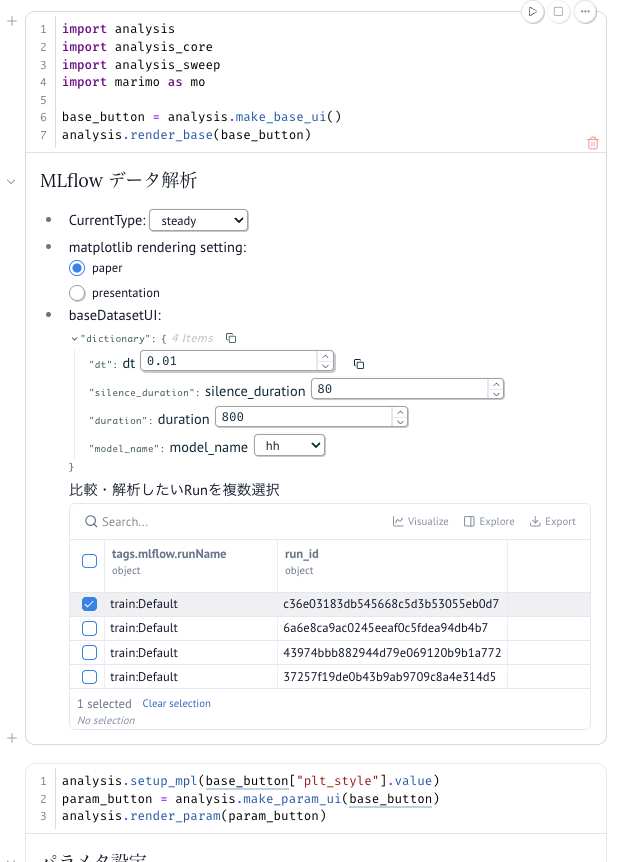

# SINDyNeuroSurrogate

[**SINDy (Sparse Identification of Nonlinear Dynamics)**](https://arxiv.org/abs/1904.02107)を用いて、神経細胞モデル（Hodgkin-Huxleyモデル等）の代理モデルを構築し、シミュレーションの高速化を目指す研究プロジェクト


脳の大規模シミュレーションにおいて、詳細な神経細胞モデルは計算コストが非常に高いという課題があります。
本プロジェクトでは、機械学習手法の一つである [SINDy](https://arxiv.org/abs/1904.02107) を用いて、複雑な非線形ダイナミクスをスパースな方程式として同定し、計算コストの低い代理モデル（Surrogate Model）への置き換えを試みています。

# Requirements
* uv
* just

## setup
```bash
uv sync
just marimo
```



## Usage

