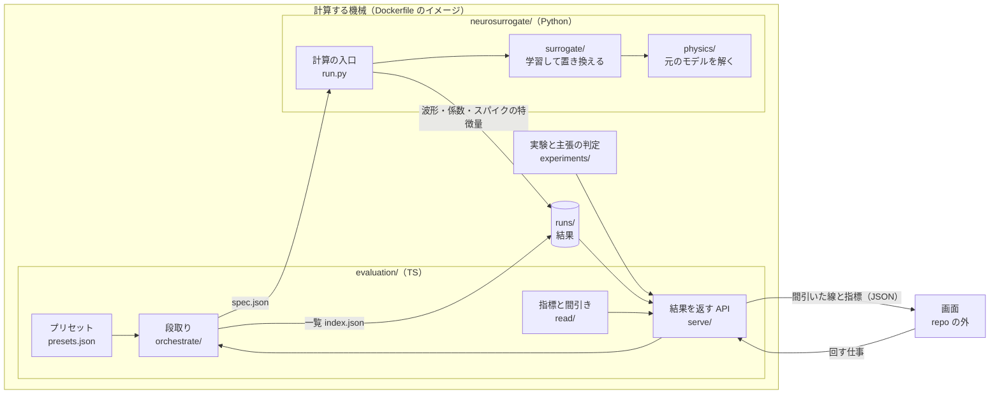
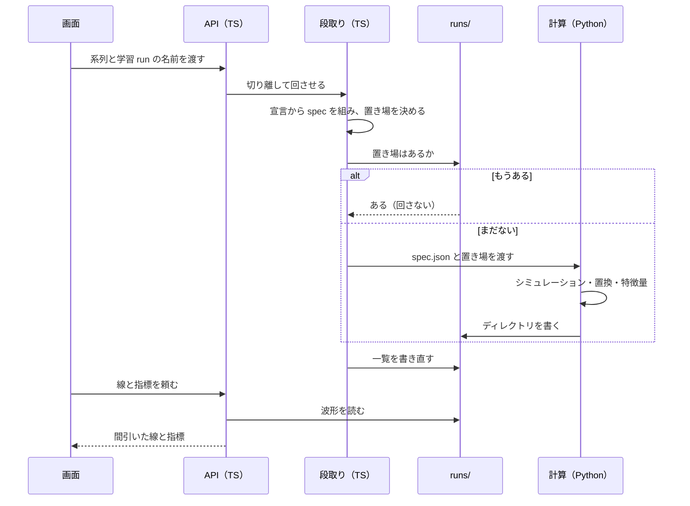
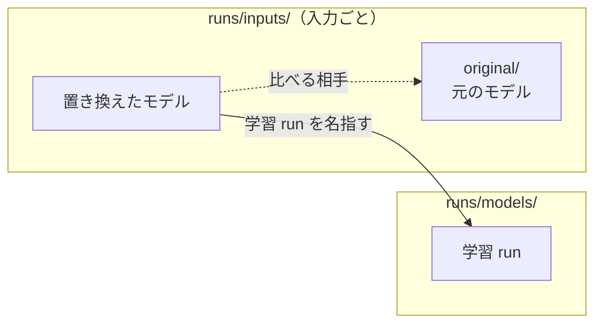

# SINDyNeuroSurrogate

神経細胞モデル（Traub、Hodgkin–Huxley）のゲート変数をまとめて減らし、状態の少ない代理モデル（サロゲート）に置き換える研究コード。まとめ方は二通りで、式から導く KAM 縮約と、データから学ぶ「圧縮 + [SINDy](https://arxiv.org/abs/1904.02107)」を同じ段取りで比べる。

脳の大規模シミュレーションでは、細胞を数千並べると計算より先にメモリの帯域で詰まる。区画あたりの状態を減らせば、そのぶんメモリが減る。

詳しい設計と規則は [AGENTS.md](AGENTS.md)、ファイルごとの役割は [neurosurrogate/AGENTS.md](neurosurrogate/AGENTS.md) にある。

## 全体の地図

```mermaid
flowchart LR
  subgraph machine["計算する機械（Dockerfile のイメージ）"]
    subgraph ts["evaluation/（TS）"]
      conf["プリセット<br/>presets.json"]
      orch["段取り<br/>orchestrate/"]
      serve["結果を返す API<br/>serve/"]
      read["指標と間引き<br/>read/"]
    end
    exp["実験と主張の判定<br/>experiments/"]
    subgraph py["neurosurrogate/（Python）"]
      entry["計算の入口<br/>run.py"]
      surr["surrogate/<br/>学習して置き換える"]
      phys["physics/<br/>元のモデルを解く"]
    end
    runs[("runs/<br/>結果")]
  end
  view["画面<br/>repo の外"]
  conf --> orch
  orch -- "spec.json" --> entry
  entry --> surr
  surr --> phys
  entry -- "波形・係数・スパイクの特徴量" --> runs
  orch -- "一覧 index.json" --> runs
  runs --> serve
  read --> serve
  exp --> serve
  serve -- "間引いた線と指標（JSON）" --> view
  view -- "回す仕事" --> serve
  serve --> orch
```

## 一回の実験の流れ

```mermaid
sequenceDiagram
  participant U as 画面
  participant A as API（TS）
  participant O as 段取り（TS）
  participant R as runs/
  participant P as 計算（Python）
  U->>A: 系列と学習 run の名前を渡す
  A->>O: 切り離して回させる
  O->>O: 宣言から spec を組み、置き場を決める
  O->>R: 置き場はあるか
  alt もうある
    R-->>O: ある（回さない）
  else まだない
    O->>P: spec.json と置き場を渡す
    P->>P: シミュレーション・置換・特徴量
    P->>R: ディレクトリを書く
  end
  O->>R: 一覧を書き直す
  U->>A: 線と指標を頼む
  A->>R: 波形を読む
  A-->>U: 間引いた線と指標
```

## 結果の置き場

```mermaid
flowchart LR
  subgraph models["runs/models/"]
    train["学習 run"]
  end
  subgraph inputs["runs/inputs/（入力ごと）"]
    original["original/<br/>元のモデル"]
    replaced["置き換えたモデル"]
  end
  replaced -- "学習 run を名指す" --> train
  replaced -. "比べる相手" .-> original
```
